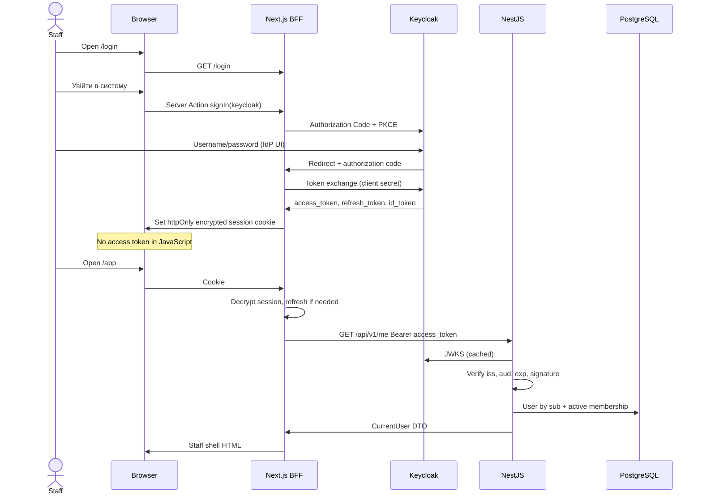

# Authentication flow

## Token refresh

When the access token is near expiry, Next.js uses the refresh token at the Keycloak token endpoint (server-side). Failure sets `RefreshTokenError`; middleware sends the user to `/login?reason=expired`.

## Logout

1. Clear Auth.js cookie.
2. Redirect to Keycloak logout (`id_token_hint` when present).
3. Return to `/login`.

## Disabled user

Keycloak login can succeed. NestJS resolves the user, sees `DISABLED`, returns 403. The app redirects to `/login?reason=denied`.
