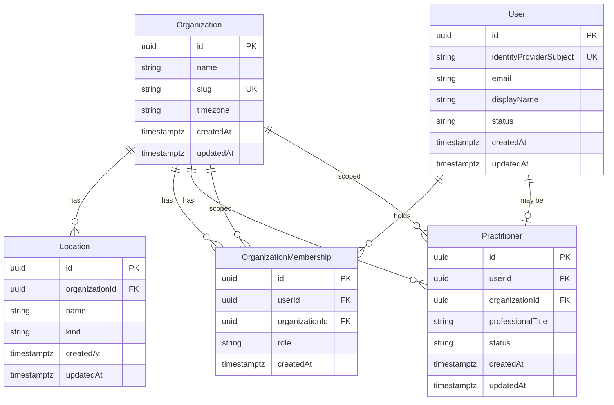
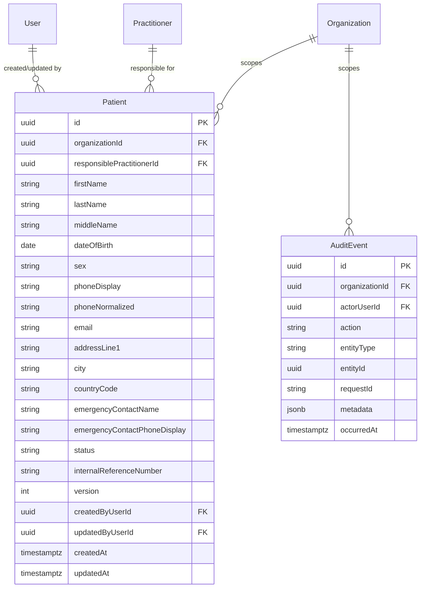
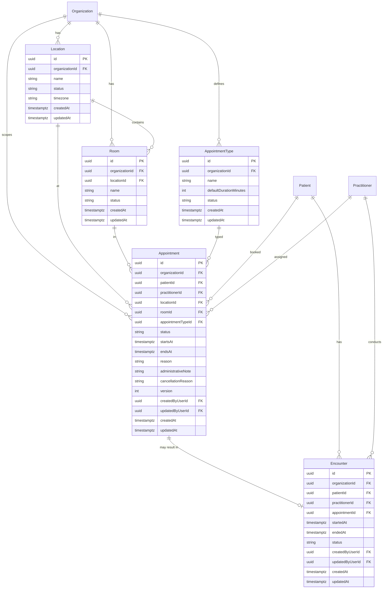
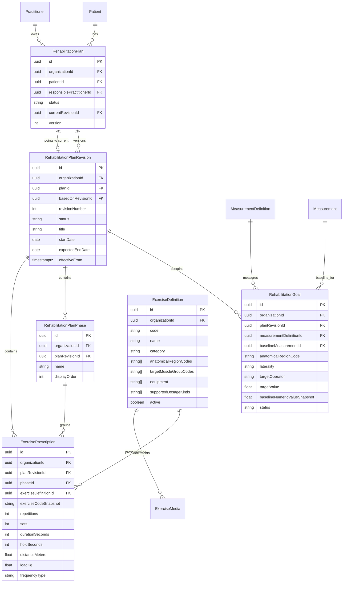
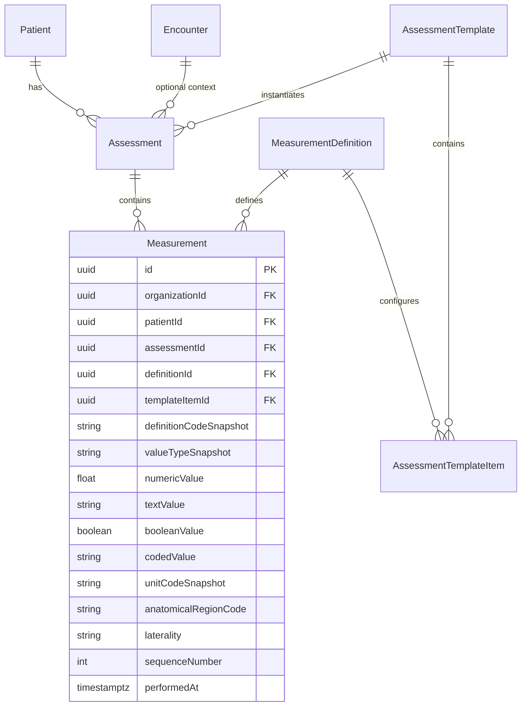
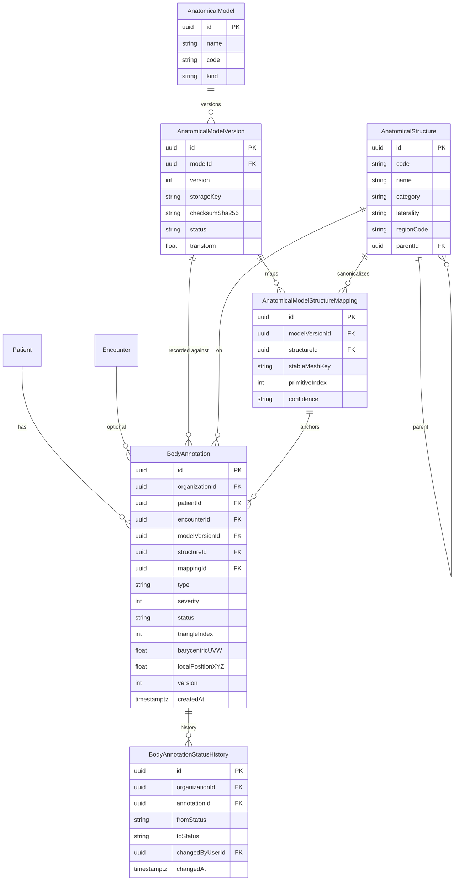
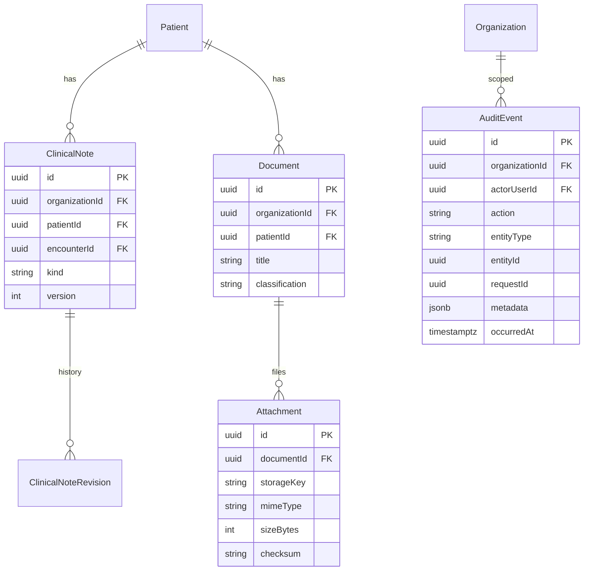
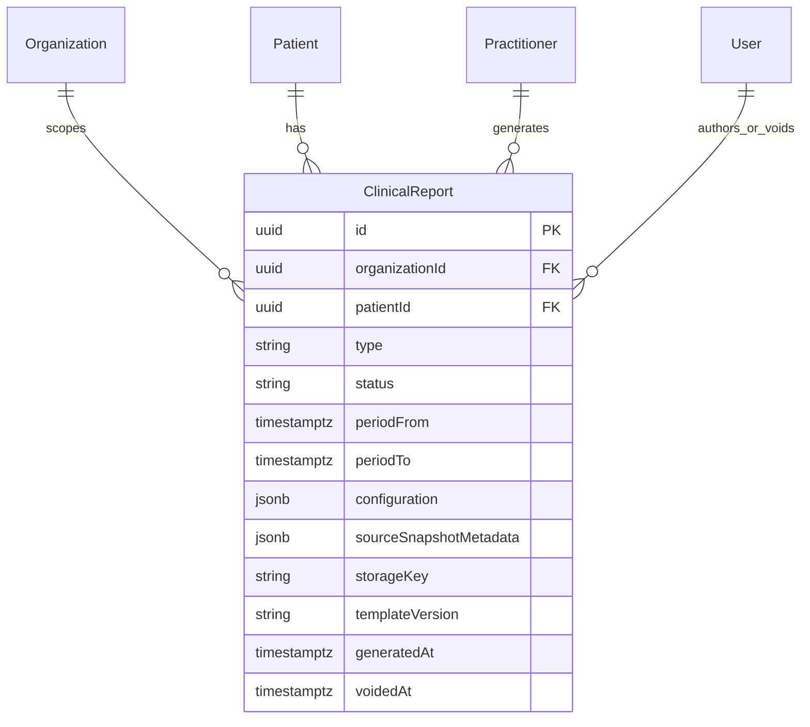

# ERD proposal (logical)

This is the logical model. Phases 3–5 implement Patient, scheduling/Encounter, and structured Assessment/Measurement respectively. See [patient-crm.md](./patient-crm.md), [scheduling.md](./scheduling.md), [assessments.md](./assessments.md), and [measurements.md](./measurements.md).

Notation: `||` one, `o{` zero-or-more, `|o` zero-or-one.

## 1. Organization and staff



**Cardinalities**

- User ↔ Organization: many-to-many via membership (a specialist locum across two clinics is possible later; v1 may constrain to one org in policy).
- User ↔ Practitioner: **at most one Practitioner per (user, organization)**.

**Uniques:** `(userId, organizationId)` on membership; `(userId, organizationId)` on Practitioner.

## 2. Patient (no auth) — Phase 3 administrative core



**Phase 3 notes**

- Required create fields: `firstName`, `lastName` only. DOB/phone optionality is product-open ([OPEN_QUESTIONS.md](../OPEN_QUESTIONS.md) Q21).
- No clinical columns on `Patient`. No patient auth attributes.
- Emergency contact is **embedded** (avoid premature normalization). Separate `PatientContact` / `Consent` entities remain future.
- `internalReferenceNumber` optional, unique per org when set; **auto-generation deferred**.
- Responsible practitioner: same org + `ACTIVE` when assigned.
- **Deletion:** status `ARCHIVED` / deactivate — not `deletedAt`. No DELETE API for normal removal.
- Indexes (anticipated): `(organizationId, status, lastName, firstName, id)`, `(organizationId, phoneNormalized)`, `(organizationId, email)`, `(organizationId, updatedAt, id)`. Ukrainian `ILIKE` search is imperfect on stock indexes — see patient-crm.md.

## 3. Appointments and encounters — Phase 4 core



**Phase 4 notes**

- `Organization.timezone` (IANA, default `Europe/Kyiv`) and `Location.timezone` drive **display**; all appointment/encounter instants stored as `timestamptz`.
- Generated column `time_range tstzrange` = `tstzrange(startsAt, endsAt, '[)')` supports exclusion indexing.
- **`encounters.appointmentId`** is unique (0..1 encounter per appointment).
- **`AppointmentParticipant`** deferred; participants are patient + practitioner (+ optional location) on the appointment row for v1.
- Indexes: `(organizationId, startsAt)`, `(organizationId, practitionerId, startsAt)`, `(organizationId, patientId, startsAt)`, `(organizationId, status, startsAt)`.

**Conflicts (implemented — [ADR-010](../adr/ADR-010-appointment-conflict-prevention.md)):**

```sql
EXCLUDE USING gist (
  organizationId WITH =,
  practitionerId WITH =,
  time_range WITH &&
)
WHERE (status IN ('SCHEDULED', 'CONFIRMED', 'CHECKED_IN', 'IN_PROGRESS'));
```

Requires `btree_gist`. Adjacent half-open slots do not overlap. Room exclusion deferred ([Q11](../OPEN_QUESTIONS.md)).

## 4. Rehabilitation and exercises



Built-in exercise definitions have `organizationId = null`; organization definitions use their own organization. Patient-specific dosage is only on `ExercisePrescription`.

Published revisions are immutable. A plan has at most one DRAFT revision (partial unique index), and `currentRevisionId` always references a published revision after activation. Goal baseline snapshots preserve historical meaning while the optional Measurement foreign key retains provenance.

## 5. Assessments and measurements — Phase 5 core



Exactly one value representation is populated and must match the definition type. Templates are immutable revisions; measurements snapshot definition meaning. `anatomicalRegionCode` is a canonical bridge to future `AnatomicalStructure`, not a mesh ID. Completed assessments are immutable and corrections use void-and-recreate in Phase 5.

## 6. Anatomy and annotations



Model/version/structure/mapping rows contain **no PHI**. Annotations and status history always include `organizationId`; every query is organization-scoped.

Incompatible model upgrades **do not** silently remap old `surfaceReference` values (ADR-004).

## 7. Notes, files, audit



**Phase 3:** patient mutations use generic append-oriented `AuditEvent` (section 2) committed **in the same transaction** as the Patient write. Metadata is controlled (`changedFields`, status transitions) — not full PHI replicas. No update/delete APIs exist for staff. Indexes include `(organizationId, entityType, entityId, occurredAt)` and `(organizationId, actorUserId, occurredAt)`.

## 8. Clinical report export



There is no progress-score table. Timeline and progress endpoints are derived projections over existing records.

## 9. Indexing philosophy

Add indexes from **real query paths**, not preemptively on every FK. Anticipated:

- Patient list / admin search: `(organizationId, status, lastName, firstName, id)`; phone/email as above. Caveat: Ukrainian case/variant folding may need generated columns or ICU later.
- Calendar: `(organizationId, practitionerId, startsAt)`
- Annotations: `(patientId, createdAt)`, `(patientId, anatomicalStructureId)`

List API uses **offset pagination** (page/pageSize) for Phase 3 — documented in patient-crm.md.

## 10. Soft delete policy

| Entity | Default |
| --- | --- |
| Patient | Status `INACTIVE` / `COMPLETED` / `ARCHIVED` |
| ClinicalNote, Assessment, BodyAnnotation | Correct via revision / supersede; no casual delete |
| Appointment | Status `CANCELLED` |
| Exercise (catalogue) | `active = false` |
| User | `DISABLED` |
| AuditEvent | Never delete via application |
| Attachment | Retention job + legal hold (future) |
